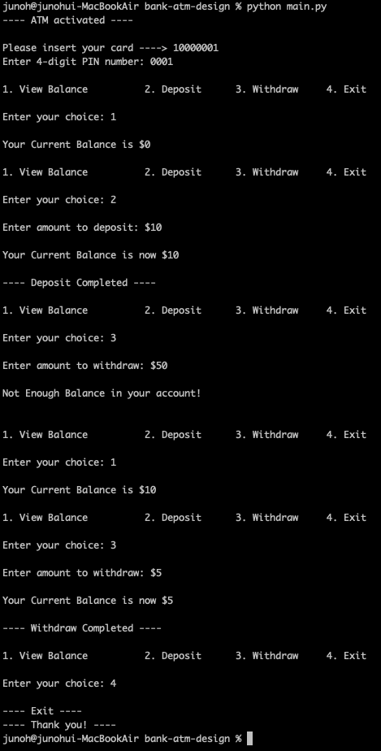
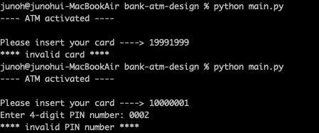
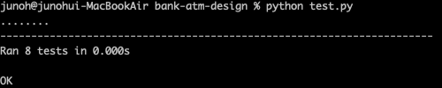

# bank-atm-design

## About

* Emulated bank atm by providing functions that show balance, deposit money, and withdraw money 
* Simplified real world applications
   * bank atm's database -> Started off main.py by pregenerating atm's user accounts with cardId, PIN number, and balance 
   * User Inserts card into card reader -> Assumed the card to have a 8-digit integer ID
   * User enters PIN number -> Assumed PIN number to be a 4-digit integer

## Installation
* Install Python3: follow instructions in <https://realpython.com/installing-python>
* From the command line: 
  * `git clone https://github.com/junoh26/bank-atm-design.git`
  * `cd bank-atm-design`

## Run ATM software with UI
* `python main.py`
### Screenshots
         

## Run test
* `python test.py`
### Screenshots
 

